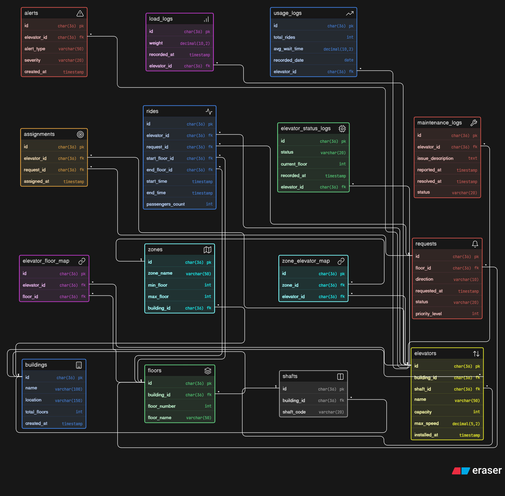

# 🛗 Smart Elevator Control System – Advanced Database Design

## 📌 Overview

This project presents an **advanced ER diagram and database design** for a smart elevator control system.

The system is designed to manage:

* Multi-building elevator infrastructure
* Floor-to-elevator mappings
* Real-time elevator requests and assignments
* Ride tracking and system analytics
* Maintenance and alert monitoring

---

## 🧠 Business Understanding

This is not a simple elevator tracking system.
It is designed as a **scalable smart control system** used in:

* 🏢 Corporate buildings
* 🏬 Shopping malls
* 🏥 Hospitals
* 🏙️ Smart city infrastructure

The system supports:

* Multiple elevators per building
* Intelligent request handling
* Zone-based elevator control
* Real-time monitoring and maintenance

---

## 🎯 Key Features Modeled

* 🏢 Building and floor management
* 🛗 Elevator and shaft configuration
* 🔗 Elevator-to-floor accessibility mapping
* 🧭 Zone-based elevator grouping (advanced control)
* 🔔 Floor request system (up/down calls)
* 🎯 Request-to-elevator assignment
* 🚶 Ride tracking (start → end lifecycle)
* 📊 Real-time elevator status monitoring
* ⚖️ Load/weight tracking for safety
* ⚠️ Alert and failure logging
* ⚙️ Maintenance tracking
* 📈 Usage analytics and performance insights

---

## 🧩 Entities Included

* **Buildings**
* **Floors**
* **Shafts**
* **Elevators**
* **Elevator Floor Map**
* **Zones**
* **Zone Elevator Map**
* **Requests**
* **Assignments**
* **Rides**
* **Elevator Status Logs**
* **Maintenance Logs**
* **Alerts**
* **Load Logs**
* **Usage Logs**

---

## 🔗 Relationships

* One **building** contains multiple floors, shafts, and elevators (1:N)
* One **elevator** operates within a shaft and serves multiple floors (M:N via mapping table)
* One **zone** groups multiple elevators for optimized control (M:N)
* One **request** is assigned to one elevator (via assignments)
* One **request** results in one ride lifecycle
* One **elevator** generates multiple logs (status, load, usage, alerts, maintenance)

---

## ⚙️ Key Design Decisions

### ✅ 1. Separation of Infrastructure and Operations

Infrastructure entities (buildings, floors, elevators) are separated from dynamic entities (requests, rides).
This ensures scalability and clean data modeling.

---

### ✅ 2. Many-to-Many Mapping for Elevator Access

An **elevator_floor_map** table is used to:

* Define which floors each elevator can access
* Support restricted or selective elevator routing

---

### ✅ 3. Zone-Based Control System

Zones are introduced to:

* Optimize elevator assignment
* Reduce wait time
* Handle high-rise buildings efficiently

---

### ✅ 4. Request → Assignment → Ride Flow

The system follows a clear lifecycle:

* Request is generated from a floor
* Elevator is assigned
* Ride is executed and tracked

---

### ✅ 5. Real-Time Monitoring System

Separate logging tables:

* **elevator_status_logs** → live status
* **load_logs** → weight tracking
* **usage_logs** → performance analytics

---

### ✅ 6. Maintenance & Alert Handling

* **maintenance_logs** track service history
* **alerts** capture failures and emergency signals

This ensures operational reliability.

---

## 📊 What This Design Solves

✔ Efficient elevator assignment and routing
✔ Supports multiple buildings and elevators
✔ Tracks complete ride lifecycle
✔ Enables real-time monitoring
✔ Improves safety through load tracking
✔ Supports predictive maintenance
✔ Provides analytics for optimization

---

## 🖼️ ER Diagram

> Add your exported diagram below:



---

## 📂 Project Structure

```plaintext id="k3l9px"
smart-elevator-db-design/
│
├── er-diagram/
│   └── eraser.png
│
├── schema/
│   └── eraser-code.txt
│
└── README.md
```

---

## 💡 Notes

* This project focuses only on **database design (ER diagram)**
* No frontend or backend implementation is included
* Designed with **scalability, modularity, and real-world applicability** in mind

---

## 🚀 Author

**Sushruto Majumdar**
